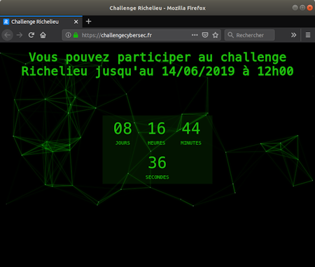

# Challenge Richelieu DGSE

Je vais vous présenter ici ma solution pour le [challenge Richelieu](https://challengecybersec.fr/) initié par la [DGSE](https://fr.wikipedia.org/wiki/Direction_g%C3%A9n%C3%A9rale_de_la_S%C3%A9curit%C3%A9_ext%C3%A9rieure). Ce challenge comporte plusieurs parties comprenant de la **stéganographie (LSB)**, de la **cryptanalyse (cassage de clé RSA)**, un **crackme avec des fonctions anti-reverse engineering**, et enfin 3 **wargames (buffer Overflow+Ropchain et double free corruption)**

Voici les différentes étapes du challenge :
  - [Échauffement](./echauffement.md)
  - [Cryptanalyse](./cryptanalyse.md)
  - [Stéganographie](./steganographie.md)
  - [Crackme](./crackme.md)
  - [Wargame #1](./Wargame1.md)
  - [Wargame #2](./Wargame2.md)
  - [Wargame #3](./Wargame3.md)
