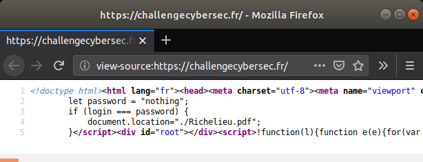
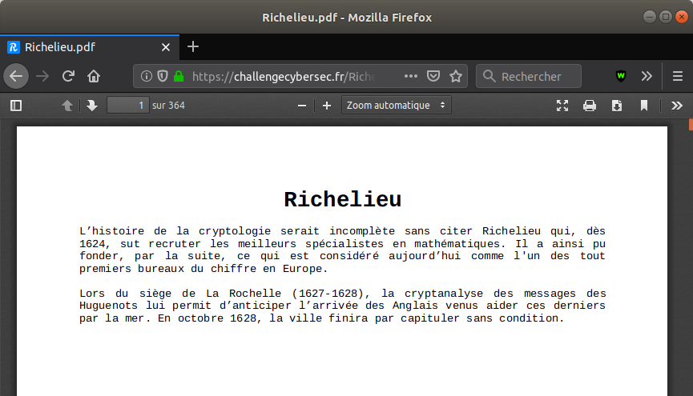

# Challenge Richelieu DGSE - Échauffement

Le challenge commence en douceur, il faut tout d'abord trouver par où commencer. On regarde le **code source de la page** :



Il contient une portion de script **javascript** :
```javascript
let login = "rien";
let password = "nothing";
if (login === password) {
  document.location="./Richelieu.pdf";
}
```
Les variables ne sont pas modifiables, on ne peut donc pas directement déclencher l'action de redirection.
Par contre on peut taper directement l'url dans le navigateur :
https://challengecybersec.fr/Richelieu.pdf

On tombe alors sur un **document pdf** de plus de 300 pages qui explique le nom du challenge : Richelieu est en quelque sorte le créateur du premier bureau du chiffre européen.


[lien vers le pdf](./Richelieu.pdf)

On sait donc qu'il va y avoir du chiffrement par la suite. Le pdf comporte un petit texte et 300 pages blanches... Étrange...
À y regarder de plus prêt, on remarque que l'on peut sélectionner quelque-chose à la suite du petit texte. Dans un lecteur de pdf, on effectue un *Ctrl+a* (tout sélectionner) suivi d'un *Ctrl+c* (copier), puis on copie le résultat dans un éditeur de texte. En retirant le petit texte au début, on obtient une longue chaîne de caractères encodée en [base64](https://fr.wikipedia.org/wiki/Base64) :

```
/9j/2wBDADIiJSwlHzIsKSw4NTI7S31RS0V
[...]
RAIAACRSXwAAAA==
```

Enregistrons cette chaîne de caractères dans le fichier **b64**.
Pour décoder cette chaîne, on lance la commande suivante (sous Linux):
```bash
cat b64 | base64 -d > fichier
```

On lance la commande file sur le fichier obtenu pour savoir de quel type de fichier il s'agit :
```bash
file fichier
file: JPEG image data, progressive, precision 8, 2110x3508, frames 1
```

Il s'agit donc d'une image jpg, renommons notre fichier en conséquence :
```bash
mv fichier image.jpg
```
Voici l'image obtenue :


À première vue, cette image n'a rien de particulier... Mais en utilisant [binwalk](https://tools.kali.org/forensics/binwalk), on s’aperçoit que des fichiers sont cachés à l’intérieur :
```bash
binwalk -e image.jpg
DECIMAL       HEXADECIMAL     DESCRIPTION
--------------------------------------------------------------------------------
445628        0x6CCBC         Zip archive data, encrypted at least v2.0 to extract, compressed size: 264, uncompressed size: 578, name: .bash_history
445979        0x6CE1B         Zip archive data, encrypted at least v1.0 to extract, compressed size: 343, uncompressed size: 331, name: suite.zip
446405        0x6CFC5         Zip archive data, encrypted at least v2.0 to extract, compressed size: 455, uncompressed size: 868, name: prime.txt
446943        0x6D1DF         Zip archive data, encrypted at least v2.0 to extract, compressed size: 643, uncompressed size: 800, name: public.key
447670        0x6D4B6         Zip archive data, encrypted at least v1.0 to extract, compressed size: 524, uncompressed size: 512, name: motDePasseGPG.txt.enc
448289        0x6D721         Zip archive data, encrypted at least v2.0 to extract, compressed size: 6244198, uncompressed size: 6243231, name: lsb_RGB.png.enc
6693156       0x662124        End of Zip archive, footer length: 22
```
**binwalk** a réussi à extraire le premier fichier, il l'a placé dans le répertoire *_image.jpg.extracted*. L'extraction des autres fichiers a échoué car ils sont contenus dans le premier fichier : **un fichier zip avec mot de passe**, binwalk ne peut pas connaître le mot de passe.
On lance alors la commande **strings** sur le fichier zip :
```
strings 6CCBC.zip
[...]
.bash_historyUT
Le mot de passePK
suite.zipUT
de cette archivePK
prime.txtUT
est : DGSE{t.D=@Bx^A%n9FQB~_VL7Zn8z=:K^4ikE=j0EGHqI}PK
public.keyUT
motDePasseGPG.txt.encUT
lsb_RGB.png.encUT
```
Le mot de passe de l'archive est donc : **DGSE{t.D=@Bx^A%n9FQB~_VL7Zn8z=:K^4ikE=j0EGHqI}**

On peut extraire les fichiers du zip grâce à ce mot de passe :
```bash
unzip 6CCBC.zip
Archive:  6CCBC.zip
[6CCBC.zip] .bash_history password:
replace .bash_history? [y]es, [n]o, [A]ll, [N]one, [r]ename: A
  inflating: .bash_history           
 extracting: suite.zip               
  inflating: prime.txt               
  inflating: public.key              
 extracting: motDePasseGPG.txt.enc   
  inflating: lsb_RGB.png.enc         
```

Voilà cette partie est achevée. Merci de votre attention. Rendez vous dans la section suivante : la partie [Cryptanalyse](./cryptanalyse.md).
